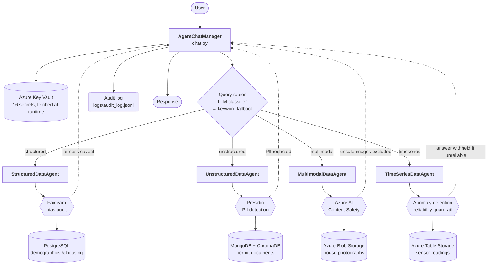

# Architecture — Ethical Multi-Agent Data Orchestrator

A command-line assistant that answers natural-language questions about five
neighborhoods (Ashford, Huntington, Kingsley, Maplewood, Rosedale) by routing each
query to a specialist agent. Every agent owns exactly one data source, holds only
that source's credentials, and runs its own ethical check as part of answering —
not as a separate step someone has to remember to run.

The governing constraint is **data sovereignty**: the three source systems were
never designed to talk to each other and privacy rules forbid merging them. So
nothing is centralized. Each agent queries its own store in place and returns only
the answer.

---

## System diagram

## Request flow

1. **Authenticate.** `DeviceCodeCredential` opens a Key Vault session. All 16
   secrets are read at runtime; none live in source, on disk, or in environment
   variables.
2. **Load agents.** Each agent is constructed with only its own connection
   configuration. The structured agent literally cannot reach MongoDB — it holds
   no MongoDB credential and imports no MongoDB client.
3. **Route.** The LLM classifier reads intent and returns one of four labels. On
   timeout, rate limit, or an unrecognized label it falls back to the deterministic
   keyword router.
4. **Answer with the check inline.** The agent queries its store and runs its
   safeguard during query processing, before returning.
5. **Act on the finding.** Detected PII is redacted from the response, flagged
   images are dropped from results, bias findings prepend a caveat, unreliable
   sensor windows withhold the conclusion.
6. **Record.** One JSONL line per query: agent, routing method, check, outcome,
   and whether the response was modified.

---

## Agent roles

### StructuredDataAgent — PostgreSQL, audited by Fairlearn

`agents/structured_data_agent.py`

Answers quantitative questions about demographics and housing by translating
natural language into SQL. A LangGraph ReAct agent drives LangChain's
`SQLDatabaseToolkit`, so the model inspects the schema and composes its own
queries against four tables: `neighborhood_houses` (5,540 rows),
`education_survey` (2,580), `neighborhood_schools` (10), `neighborhood_hospitals`
(6).

Its safeguard is a **Fairlearn bias audit** that runs on every query before the
answer is returned. It discovers tables through SQLAlchemy's inspector, identifies
genuine sensitive features, and measures each other column against them three
ways: binary columns via `MetricFrame` selection rates and demographic parity
difference; numeric columns via a min/max ratio of group means; small categorical
columns via a percentage cross-tabulation.

The detection step is the subtle part. Only `identified_race` and `gender` are
per-row group labels. `neighborhood_schools` and `neighborhood_hospitals` carry
columns like `male_students` and `white_patients` that are aggregate **counts** —
grouping on them would emit statistically meaningless output under a fairness
heading, which is worse than no audit because it looks like one. The keyword list
is deliberately narrow, and a dtype-and-cardinality guard backs it up.

### UnstructuredDataAgent — MongoDB + ChromaDB, audited by Presidio

`agents/unstructured_data_agent.py`

Answers questions about 21 construction-permit PDFs using retrieval-augmented
generation. `build_index` reads documents from MongoDB, embeds them with
`AzureOpenAIEmbeddings` (`text-embedding-ada-002`), and stores vectors in a local
ChromaDB index keyed by Mongo `ObjectId`. At query time it runs a similarity
search, fetches the **full documents back from MongoDB** by ObjectId, and grounds
an `AzureChatOpenAI` answer in that text. ChromaDB holds only vectors and ids —
the authoritative document never leaves MongoDB.

Its safeguard is **Presidio PII detection** over the retrieved source documents.
These permits are full of personal data: applicant names, home addresses, phone
numbers, email addresses. Entities scoring at or above 0.85 are reported with
their confidence; URLs are excluded as public references rather than personal
data. Detection is then acted on — matched spans are redacted from the outgoing
answer, because detecting PII and then printing it back would defeat the check.

### MultimodalDataAgent — Azure Blob Storage, audited by Content Safety

`agents/multimodal_data_agent.py`

Answers "find me a house like mine" by visual similarity. CLIP
(`openai/clip-vit-base-patch32`) embeds the query image and each of the 12 house
photographs in Blob Storage, embeddings are L2-normalized, and cosine similarity
ranks the results. The top-k matches are returned with a rendered comparison
figure.

Its safeguard is **Azure AI Content Safety**, which analyses every image for Hate,
SelfHarm, Sexual, and Violence severity as it is loaded — including the user's own
query image, screened *before* the search runs so an unsafe input aborts the sweep
rather than being silently embedded. Flagged images are excluded from results, not
merely logged. Images beyond the service's 2048px limit are downscaled for the
safety call only, so ranking still uses full-resolution pixels.

### TimeSeriesDataAgent — Azure Table Storage, guarded by anomaly detection

`agents/timeseries_data_agent.py`

A fourth modality beyond the required three. Answers questions about hourly
environmental readings — PM2.5, noise, water usage — for the five neighborhoods,
stored in Azure Table Storage partitioned by neighborhood and keyed by timestamp
(1,680 readings). It computes per-series statistics and grounds an LLM answer in
those numbers.

Its safeguard is a **reliability guardrail** rather than a fairness or privacy
one. Sensor feeds drift, spike, and drop out; stating a mean over a contaminated
or too-short window as fact is the ethical failure here. Readings at |z| ≥ 3.0
from their series mean are surfaced explicitly with a caveat attached to the
answer, and where every matching series holds fewer than 24 readings the agent
**withholds the conclusion** and says why instead of answering.

It uses its own storage account, separate from the image store, so the per-source
credential isolation that holds for the other three holds here too.

---

## Federated data management

| Agent | Data source | Credentials held | Ethical check |
|---|---|---|---|
| StructuredDataAgent | PostgreSQL Flexible Server | PG host/db/user/password, Azure OpenAI **key1** | Fairlearn bias audit |
| UnstructuredDataAgent | Cosmos DB for MongoDB | Mongo URI/db/collection, Azure OpenAI **key2** | Presidio PII detection |
| MultimodalDataAgent | Blob Storage (`stnbhdimg4hbr`) | Blob connection string, Content Safety endpoint/key | Azure AI Content Safety |
| TimeSeriesDataAgent | Table Storage (`stnbhdsensors4hbr`) | Table connection string | Anomaly / reliability guardrail |

Three properties hold by construction rather than by convention:

- **No shared credentials.** The two storage-backed agents use *separate storage
  accounts*, and the two Azure OpenAI consumers use *different keys on the same
  account* — so each is independently rotatable and a leak is contained.
- **No cross-source access.** Each agent module imports only its own client
  library. `test_R4_5_each_agent_module_imports_only_its_own_data_source` asserts
  this from live module namespaces.
- **No writes.** No agent calls `insert_one`, `upload_blob`, `upsert_entity`, or
  `to_sql`. Data is read in place and never copied between stores; only the
  loaders under `data/` write, and each writes to exactly one store.

## Known limitations

- ChromaDB is a local runtime cache of embeddings. Reloading MongoDB mints new
  ObjectIds, so the index must be cleared or stale vectors point at documents that
  no longer exist. `scripts/seed_data.sh` does this automatically on a forced
  reload.
- The bias audit reads every table on every structured query. At this data volume
  (~8k rows) that is inexpensive, but it would need scoping on a larger database.
- Content Safety severity is checked as non-zero. A production system would set
  per-category thresholds rather than treating severity 1 and severity 6 alike.
